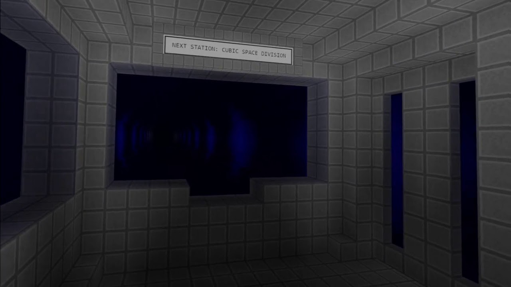

[SpaceTrain](https://train.gatunes.com/)
==

[](https://train.gatunes.com/)

> A combined set of examples for the [blocks-editor](https://blocks-editor.gatunes.com/)

#### Live demo

[https://train.gatunes.com/](https://train.gatunes.com/)

#### Tutorials

 * [Create WebXR voxels worlds from scratch](https://youtu.be/rDMLVdFtnYo)

#### Local development

```bash
# clone this repo
git clone https://github.com/danielesteban/blocks-editor-examples.git
cd blocks-editor-examples
# install dependencies
npm install
# start the dev environment:
npm start
# open https://localhost:5000/ in your browser
```
